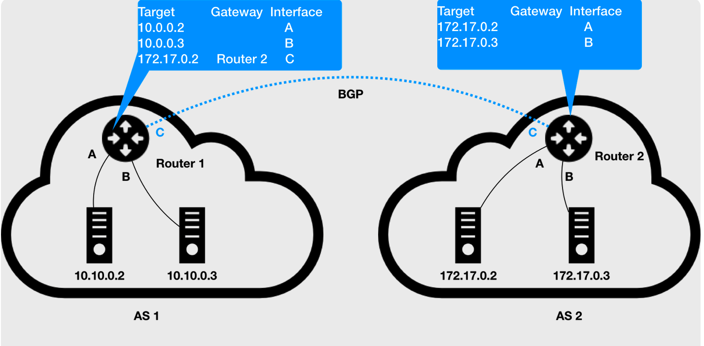

# BGP

BGP（Border Gateway Protocol）即边界网关协议，它是一个 Linux 内核原生就支持的、专门用在大规模数据中心里维护不同的“自治系统”之间路由信息的、无中心的路由协议。

假设有两个自治系统（Autonomous System，简称为 AS）：AS 1 和 AS 2。而所谓的一个自治系统，指的是一个组织管辖下的所有 IP 网络和路由器的全体，可以把它想象成一个小公司里的所有主机和路由器。在正常情况下，自治系统之间不会有任何“来往”。但是，如果这样两个自治系统里的主机，要通过 IP 地址直接进行通信，我们就必须使用路由器把这两个自治系统连接起来。

比如，AS 1 里面的主机 10.10.0.2，要访问 AS 2 里面的主机 172.17.0.3 的话。它发出的 IP 包，就会先到达自治系统 AS 1 上的路由器 Router 1。此时，Router 1 的路由表里有这样一条规则：目的地址是 172.17.0.2 包，应该经过 Router 1 的 C 接口，发往网关 Router 2（即：自治系统 AS 2 上的路由器）。所以 IP 包就会到达 Router 2 上，然后经过 Router 2 的路由表，从 B 接口出来到达目的主机 172.17.0.3。但是反过来，如果主机 172.17.0.3 要访问 10.10.0.2，那么这个 IP 包，在到达 Router 2 之后，就不知道该去哪儿了。因为在 Router 2 的路由表里，并没有关于 AS 1 自治系统的任何路由规则。所以这时候，网络管理员就应该给 Router 2 也添加一条路由规则，比如：目标地址是 10.10.0.2 的 IP 包，应该经过 Router 2 的 C 接口，发往网关 Router 1。

像上面这样负责把自治系统连接在一起的路由器，我们就把它形象地称为：边界网关。它跟普通路由器的不同之处在于，它的路由表里拥有其他自治系统里的主机路由信息。在网络拓扑结构非常复杂的情况下，每个自治系统都有成千上万个主机、无数个路由器，甚至是由多个公司、多个网络提供商、多个自治系统组成。这时候，如果还要依靠人工来对边界网关的路由表进行配置和维护，那是绝对不现实的。而这种情况下，BGP 大显身手的时刻就到了。在使用了 BGP 之后，你可以认为，在每个边界网关上都会运行着一个小程序，它们会将各自的路由表信息，通过 TCP 传输给其他的边界网关。而其他边界网关上的这个小程序，则会对收到的这些数据进行分析，然后将需要的信息添加到自己的路由表里。这样，下图中 Router 2 的路由表里，就会自动出现 10.10.0.2 和 10.10.0.3 对应的路由规则了。

所谓 BGP，就是在大规模网络中实现节点路由信息共享的一种协议。

