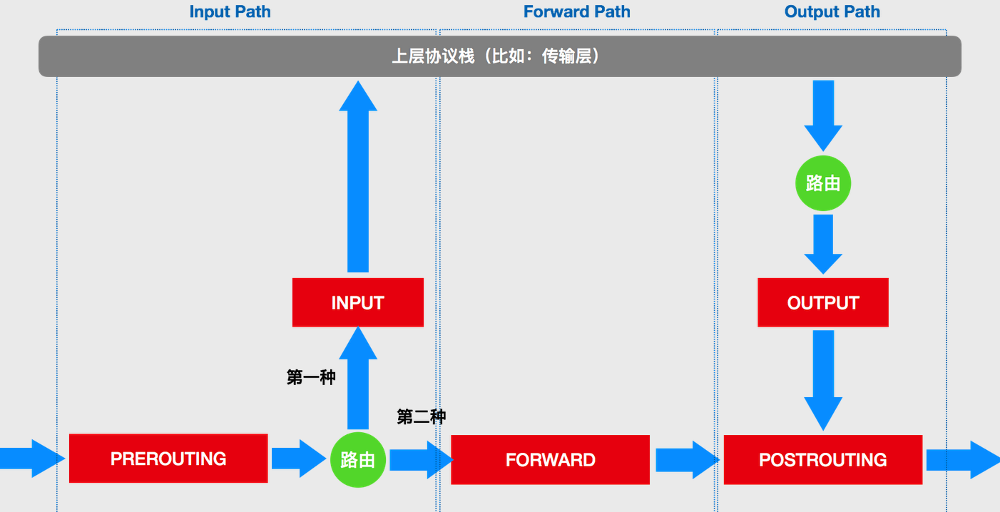

# iptables

iptables 只是一个操作 Linux 内核 Netfilter 子系统的“界面”。Netfilter是 Linux 内核里挡在“网卡”和“用户态进程”之间的一道“防火墙”。IP 包“一进一出”的两条路径上，有几个关键的“检查点”，它们正是 Netfilter 设置“防火墙”的地方。在 iptables 中，这些“检查点”被称为：链（Chain）。这是因为这些“检查点”对应的 iptables 规则，是按照定义顺序依次进行匹配的。

这些“检查点”的具体工作原理，可以用如下所示的示意图进行描述：

- 当一个 IP 包通过网卡进入主机之后，它就进入了 Netfilter 定义的流入路径（Input Path）里。在这个路径中，IP 包要经过路由表路由来决定下一步的去向。而在这次路由之前，Netfilter 设置了一个名叫 PREROUTING 的“检查点”。在 Linux 内核的实现里，所谓“检查点”实际上就是内核网络协议栈代码里的 Hook（比如，在执行路由判断的代码之前，内核会先调用 PREROUTING 的 Hook）。
- 而在经过路由之后，IP 包的去向就分为了两种：第一种，继续在本机处理；第二种，被转发到其他目的地。我们先说一下 IP 包的第一种去向。这时候，IP 包将继续向上层协议栈流动。在它进入传输层之前，Netfilter 会设置一个名叫 INPUT 的“检查点”。到这里，IP 包流入路径（Input Path）结束。接下来，这个 IP 包通过传输层进入用户空间，交给用户进程处理。
- 而处理完成后，用户进程会通过本机发出返回的 IP 包。这时候，这个 IP 包就进入了流出路径（Output Path）。此时，IP 包首先还是会经过主机的路由表进行路由。路由结束后，Netfilter 就会设置一个名叫 OUTPUT 的“检查点”。
- 在 OUTPUT 之后，再设置一个名叫 POSTROUTING“检查点”。你可能会觉得奇怪，为什么在流出路径结束后，Netfilter 会连着设置两个“检查点”呢？
- 这就要说到在流入路径里，路由判断后的第二种去向了。在这种情况下，这个 IP 包不会进入传输层，而是会继续在网络层流动，从而进入到转发路径（Forward Path）。在转发路径中，Netfilter 会设置一个名叫 FORWARD 的“检查点”。
- 而在 FORWARD“检查点”完成后，IP 包就会来到流出路径。而转发的 IP 包由于目的地已经确定，它就不会再经过路由，也自然不会经过 OUTPUT，而是会直接来到 POSTROUTING“检查点。所以说，POSTROUTING 的作用，其实就是上述两条路径，最终汇聚在一起的“最终检查点”。

每一个“检查点”上可以分配不同的检测动作，比如：raw、nat、filter 等等。在 iptables 里，这些检测动作叫作：表。比如，同样是 OUTPUT 这个“检查点”，filter Output 和 nat Output 在 iptables 里的语法和参数，就完全不一样，实现的功能也完全不同。所以说，iptables 表的作用，就是在某个具体的“检查点”（比如 Output）上，按顺序执行几个不同的检查动作（比如，先执行 nat，再执行 filter）。





## 例子


```bash
iptables -A FORWARD -d $podIP -m physdev --physdev-is-bridged -j KUBE-POD-SPECIFIC-FW-CHAINiptables -A FORWARD -d $podIP -j KUBE-POD-SPECIFIC-FW-CHAIN
iptables -A FORWARD -d $podIP -j KUBE-POD-SPECIFIC-FW-CHAIN
```

第一条 FORWARD 链“拦截”的是一种特殊情况：它对应的是同一台宿主机上容器之间经过 CNI 网桥进行通信的流入数据包。其中，–physdev-is-bridged 的意思就是，这个 FORWARD 链匹配的是，通过本机上的网桥设备，发往目的地址是 podIP 的 IP 包。这条规则最后都跳转（即：-j）到了名叫 KUBE-POD-SPECIFIC-FW-CHAIN 的规则上。

第二条 FORWARD 链“拦截”的则是最普遍的情况，即：容器跨主通信。这时候，流入容器的数据包都是经过路由转发（FORWARD 检查点）来的。这条规则最后都跳转（即：-j）到了名叫 KUBE-POD-SPECIFIC-FW-CHAIN 的规则上。

```bash

iptables -A KUBE-POD-SPECIFIC-FW-CHAIN -j KUBE-NWPLCY-CHAIN
iptables -A KUBE-POD-SPECIFIC-FW-CHAIN -j REJECT --reject-with icmp-port-unreachable
```

这个 KUBE-POD-SPECIFIC-FW-CHAIN 的作用，就是做出“允许”或者“拒绝”的判断。

第一条规则里，我们会把 IP 包转交给前面定义的 KUBE-NWPLCY-CHAIN 规则去进行匹配。如果匹配成功，那么 IP 包就会被“允许通过”。而如果匹配失败，IP 包就会来到第二条规则上。

第二条规则是一条 REJECT 规则。通过这条规则，不满足 NetworkPolicy 定义的请求就会被拒绝掉，从而实现了对该容器的“隔离”。


