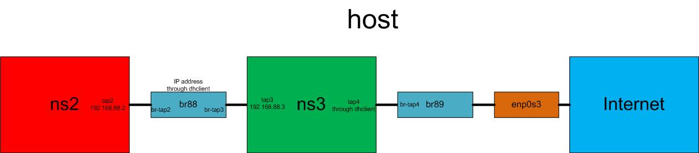

# ???Namespace-Bridge-Namespace-Bridge-Internet Communication
Communication between 2 Namespaces and connect to Internet

## Topology
 

## Prerequisite
- VirtualBox Network on `NAT` or `Bridge` mode
- In the VM, stop the `network-manager`: `sudo service network-manager stop`
- Activate forwarding in the VM: `iptables -P FORWARD ACCEPT`

## Manipulation
- create 2 network namespaces:
```bash
ip netns add ns2
ip netns add ns3
ip netns list
```

- create 2 veth pairs:
```bash
ip link add dev tap2 type veth peer name br-tap2
ip link add dev tap3 type veth peer name br-tap3
ip link add dev tap4 type veth peer name br-tap4
```

- set veth to the namespaces:
```bash
ip link set tap2 netns ns2
ip link set tap3 netns ns3
ip link set tap4 netns ns3
```

- create and setup a Linux bridge `br88`: 
```bash
brctl addbr br88
# brctl showmacs br88
brctl addif br88 br-tap2
brctl addif br88 br-tap3
brctl showmacs br88
```

- create and setup a Linux bridge `br89`: 
```bash
brctl addbr br89
# brctl showmacs br89
brctl addif br89 br-tap4
brctl addif br89 enp0s3
brctl showmacs br89
```

- activate all the devices:
```bash
ip link set dev br-tap2 up
ip link set dev br-tap3 up
ip link set dev br-tap4 up
ip link set dev br88 up
ifconfig br89 up
dhclient br89 #get a ip address for the bridge 
ip netns exec ns2 ip link set dev lo up
ip netns exec ns2 ip link set dev tap2 up
ip netns exec ns3 ip link set dev lo up
ip netns exec ns3 ip link set dev tap3 up
ip netns exec ns3 ip link set dev tap4 up
ip netns exec ns3 dhclient tap4
brctl showmacs br88
brctl showmacs br89
```

- associate IP addresses to the devices: 
```bash
ip netns exec ns2 ip addr add 192.168.88.2/24 dev tap2
ip netns exec ns3 ip addr add 192.168.88.3/24 dev tap3
```

The script can be found [here](ns-br-ns-br-ext.sh) and the cleanup script is [here](ns-br-ns-br-ext-clean.sh)

## Test
```bash
ip netns exec ns2 ping 8.8.8.8
```

## Bug
If cannot ping, ping these device and try to analyze the problem
```bash
ip netns exec ns2 ping 192.168.88.3
ip netns exec ns3 ping 192.168.88.2
ip netns exec ns3 ping 8.8.8.8
```
