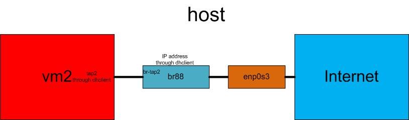

# Linux Bridge with Namespace
Communication from VM to Internet

## Topology
 

## Prerequisite
- VirtualBox Network on `NAT` mode
- In the VM, stop the `network-manager`: `sudo service network-manager stop`

## Manipulation
- create a VETH pair: `ip link add tap2 type veth peer name br-tap2`
- create a Linux bridge: `brctl addbr br88`
- bind VETH to the bridge: `brctl addif br88 br-tap2`
- bind physical interface to the bridge: `brctl addif br88 enp0s3`

- create a KVM VM: `qemu XXX`

- activate VETH: `ip link set br-tap2 up`
- activate Linux bridge: `ifconfig br88 up`

- get an IP address for the bridge: `dhclient br88` 

## In the VM
- activate interface *lo*: `XXX`
- activate interface *tap2*: `XXX`
- get an IP address for the VETH: `dhclient tap2`

## Test
- `ip netns exec ns2 ping 10.0.2.XX`

## Cleanup
The script can be found [here](vm-br-ext.sh) and the cleanup script is [here](vm-br-ext-clean.sh)