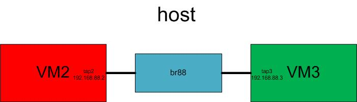

# Linux Bridge with KVM VM Lab
## Topology


## Network Devices
- create a Linux private bridge: `ip link add br88 type bridge`
- enable forwarding: `echo 1 > /proc/sys/net/ipv4/ip_forward` 
- create 2 *TAP* devices:
 ```bash
ip tuntap add mode tap tap2
ip tuntap add mode tap tap3
```
- activate 2 *TAP* devices:  
```bash
ip link set tap2 up
ip link set tap3 up
```
- bind 2 *TAP* devices:
```bash
ip link set tap2 master br88
ip link set tap3 master br88
ip link set br88 up
```
- check: `brctl show br88`

## KVM
- launch VM2 and VM3:
```bash
qemu-system-x86_64 -hda debian_wheezy_amd64_standard2.qcow2 -device e1000,netdev=net0,mac=00:11:22:33:44:02 -netdev tap,id=net0,ifname=tap2,script=no,downscript=no -name vm2 -daemonize
qemu-system-x86_64 -hda debian_wheezy_amd64_standard3.qcow2 -device e1000,netdev=net0,mac=00:11:22:33:44:03 -netdev tap,id=net0,ifname=tap3,script=no,downscript=no -name vm3 -daemonize
```

The `debian_wheezy_amd64_standard.qcow2` can be founded here `https://people.debian.org/~aurel32/qemu/amd64/`

The script for the configuration is [here](vm-br-vm-kvm.sh)

- config IP address of each VM (login: `root`, password): `root`:
  - VM2:
```bash
ip link set tap2 up # or use eth0 instead of tap2
ip addr add 192.168.88.2/24 dev tap2 # or use eth0 instead of tap2
```   
  - VM3: 
```bash
ip link set tap3 up # or use eth1 instead of tap3
ip addr add 192.168.88.3/24 dev tap3 # or use eth1 instead of tap3
```

## Test
- in VM2: `ping 192.168.88.3`

## Cleanup
The cleanup script is [here](vm-br-vm-kvm-clean.sh)

## Bug
If cannot ping, add an IP address for *br88* and ping the bridge from the VM
```bash
ip addr add 192.168.88.4/24 dev br88
```

