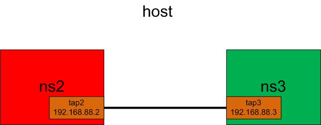

# Namespace to Namespace Communication Through VETH
communicate 2 namespaces through a pair of VETH

## Topology


## Manipulation
- add the 2 namespaces:
```bash
ip netns add ns2
ip netns add ns3
```
- create the veth pair: `ip link add tap2 type veth peer name tap3`
- move the interfaces to the namespaces:
```bash
ip link set tap2 netns ns2
ip link set tap3 netns ns3
```
- bring up the links:
```bash
ip netns exec ns2 ip link set dev tap2 up
ip netns exec ns3 ip link set dev tap3 up
```
- assign the ip addresses:
```bash
ip netns exec ns2 ip addr add 192.168.88.2/24 dev tap2
ip netns exec ns3 ip addr add 192.168.88.3/24 dev tap3
```

The script can be found [here](ns-veth-ns.sh)

## Test
- `ip netns exec ns2 ping 192.168.88.3`

## Cleanup 
- `ip netns del ns2`
- `ip netns del ns3`

The cleanup script is [here](ns-veth-ns-clean.sh)
