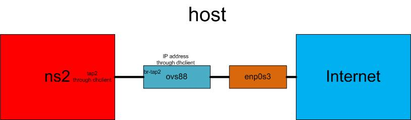

# OpenVSwitch with Namespace
Communication from namespace to Internet

## Topology
 

## Prerequisite
- VirtualBox Network on `NAT` mode
- In the VM, stop the `network-manager`: `sudo service network-manager stop`

## Manipulation
- create a namespace: `ip netns add ns2`

- create a VETH pair: `ip link add tap2 type veth peer name ovs-tap2`
- create a Linux bridge: `ovs-vsctl add-br ovs88`
- bind VETH to the bridge: `ovs-vsctl add-port ovs88 ovs-tap2`
 
- bind physical interface to the bridge: `ovs-vsctl add-port ovs88 enp0s3`

- activate VETH: `ip link set ovs-tap2 up`
- activete Linux bridge: `ifconfig ovs88 up`

- get an IP address for the bridge: `dhclient ovs88` 

- put a VETH to the namespace: `ip link set tap2 netns ns2`
- activate interface in the namespace: `ip netns exec ns2 ip link set dev lo up`
- activate interface in the namespace: `ip netns exec ns2 ip link set tap2 up`

- get an IP address for the VETH: `ip netns exec ns2 dhclient tap2`

The script can be found [here](ns-ovs-ext.sh) and the cleanup script is [here](ns-ovs-ext-clean.sh)

## Test
- `ip netns exec ns2 ping 8.8.8.8`