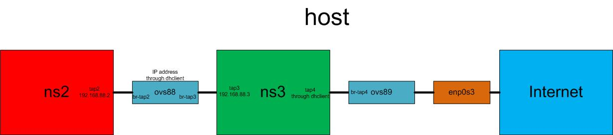

# ???Namespace-OVS-Namespace-OVS-Internet Communication
Communication between 2 Namespaces and connect to the Internet

## Topology
 

## Prerequisite
- VirtualBox Network on `NAT` mode

## Manipulation
- create 2 network namespaces:
```bash
ip netns add ns2
ip netns add ns3
ip netns list
```

- create 3 veth pairs:
```bash
ip link add dev tap2 type veth peer name ovs-tap2
ip link add dev tap3 type veth peer name ovs-tap3
ip link add dev tap4 type veth peer name ovs-tap4
```

- set veth to the namespaces:
```bash
ip link set tap2 netns ns2
ip link set tap3 netns ns3
ip link set tap4 netns ns3
```

- create and setup a OVS bridge `ovs88`: 
```bash
ovs-vsctl add-br ovs88
ovs-vsctl add-port ovs88 ovs-tap2
ovs-vsctl add-port ovs88 ovs-tap3
```

- create and setup a OVS bridge `ovs89`: 
```bash
ovs-vsctl add-br ovs89
ovs-vsctl add-port ovs89 ovs-tap4
ovs-vsctl add-port ovs89 enp0s3
```

- activate all the devices:
```bash
ip link set dev ovs-tap2 up
ip link set dev ovs-tap3 up
ip link set dev ovs-tap4 up
ip link set dev ovs88 up
ifconfig ovs89 up 
dhclient ovs89
ip netns exec ns2 ip link set dev lo up
ip netns exec ns2 ip link set dev tap2 up
ip netns exec ns3 ip link set dev lo up
ip netns exec ns3 ip link set dev tap3 up
ip netns exec ns3 ip link set dev tap4 up
ip netns exec ns3 dhclient tap4
```

- associate IP addresses to the devices: 
```bash
ip netns exec ns2 ip addr add 192.168.88.2/24 dev tap2
ip netns exec ns3 ip addr add 192.168.88.3/24 dev tap3
```

The script can be found [here](ns-ovs-ns-ovs-ext.sh) and the cleanup script is [here](ns-ovs-ns-ovs-ext-clean.sh).

## Test
```bash
ip netns exec ns2 ping 8.8.8.8
```
