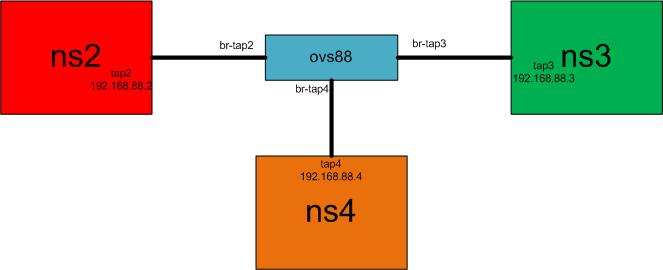

# OpenVSwitch Manipulation Lab
## Install OVS
Install packages
```bash
sudo apt install openvswitch-common openvswitch-switch
```

Check OVS services
```bash
ps aux grep openvswitch
lsmod  grep openvswitch
```

Check all files used by `ovs-vswitchd`
```bash
lsof -p PID
```

Check all files used by `ovsdb-server`
```bash
lsof -p PID
```

Check all functions used by ovs-vsctl
```bash
strace ovs-vsctl show
```

## Scenario
 

## OVS Bridge
- `ovs-vsctl add-br sw`: add a new OVS bridge 
- `ovs-vsctl list bridge sw`: lookup
- `ovs-vsctl del-br sw`: remove the bridge
- `ovs-vsctl show`: show the `OVS` configuration of a server
  - `OVS manager` is for the whole server
  - `OVS controller` is for a dedicated switch

## Namespace and Network Setup
Create namespaces
```bash
ip netns add ns1
ip netns add ns2
ip netns add ns3
```

Create network devices
```bash
ip link add eth0-1 type veth peer name veth-1
ip link add eth0-2 type veth peer name veth-2
ip link add eth0-3 type veth peer name veth-3
```

Device allocation
```bash
ip link set eth0-1 netns ns1
ip link set eth0-2 netns ns2
ip link set eth0-3 netns ns3
ovs-vsctl add-br sw
ovs-vsctl add-port sw veth-1
ovs-vsctl add-port sw veth-2
ovs-vsctl add-port sw veth-3
```

Device Activation
```bash
ip link set dev veth-1 up
ip link set dev veth-2 up
ip link set dev veth-3 up
ip netns exec ns1 ip link set dev lo up
ip netns exec ns1 ip link set eth0-1 up
ip netns exec ns1 ip address add 8.8.8.7/24 dev eth0-1
ip netns exec ns2 ip link set dev lo up
ip netns exec ns2 ip link set eth0-2 up
ip netns exec ns2 ip address add 8.8.8.8/24 dev eth0-2
ip netns exec ns3 ip link set dev lo up
ip netns exec ns3 ip link set eth0-3 up
ip netns exec ns3 ip address add 8.8.8.9/24 dev eth0-3
```

## Flow Table Configuration
### ovs-ofctl 
- `ovs-ofctl dump-flows sw`: show all the flow tables
  - `table=0`: output for one table
  - `--color`: don't work for ssh
- `ovs-ofctl del-flows sw`: cleanup the flow tables
- authorize all IP flows between 1 and 2:
```bash
ovs-ofctl add-flow sw arp,actions=normal
ovs-ofctl add-flow sw priority=800,ip,nw_src=8.8.8.7,nw_dst=8.8.8.8,actions=normal
ovs-ofctl add-flow sw priority=800,ip,nw_src=8.8.8.8,nw_dst=8.8.8.7,actions=normal
```
- `ovs-ofctl dump-flows sw`: show the flow tables
- test:
```bash
ip netns exec ns1 ping 8.8.8.8 # OK 
ip netns exec ns1 ping 8.8.8.9 # OK
ip netns exec ns2 ping 8.8.8.7 # OK
ip netns exec ns2 ping 8.8.8.9 # OK
ip netns exec ns3 ping 8.8.8.7 # OK
ip netns exec ns3 ping 8.8.8.8 # OK
```

### ICMP Flow from 1 to 2
- `ovs-ofctl del-flows sw`: clean up 
- `ovs-ofctl dump-flows sw`: show
- authorize only `ICMP` flows from 1 to 2: 
```bash
ovs-ofctl add-flow sw arp,actions=normal
ovs-ofctl add-flow sw priority=800,icmp,icmp_type=8,nw_src=8.8.8.7,nw_dst=8.8.8.8,actions=normal
ovs-ofctl add-flow sw priority=800,icmp,icmp_type=0,nw_src=8.8.8.8,nw_dst=8.8.8.7,actions=normal
```
- `ovs-ofctl dump-flows sw`: show
- test:
```bash
ip netns exec ns1 ping 8.8.8.8 # OK 
ip netns exec ns1 ping 8.8.8.9 # KO
ip netns exec ns2 ping 8.8.8.7 # KO
ip netns exec ns2 ping 8.8.8.9 # KO
ip netns exec ns3 ping 8.8.8.7 # KO
ip netns exec ns3 ping 8.8.8.8 # KO
```

### ICMP Flow from 1 to all
- `ovs-ofctl del-flows sw`: clean up 
- `ovs-ofctl dump-flows sw`: show
- authorize only `ICMP` flows from 1 to all other servers
```bash
ovs-ofctl add-flow sw arp,actions=normal
ovs-ofctl add-flow sw priority=800,icmp,icmp_type=8,nw_src=8.8.8.7,nw_dst=8.8.8.0/24,actions=normal
ovs-ofctl add-flow sw priority=800,icmp,icmp_type=0,nw_src=8.8.8.0/24,nw_dst=8.8.8.7,actions=normal
```
- `ovs-ofctl dump-flows sw`: show
- test: 
```bash
ip netns exec ns1 ping 8.8.8.8 # OK 
ip netns exec ns1 ping 8.8.8.9 # OK
ip netns exec ns2 ping 8.8.8.7 # KO
ip netns exec ns2 ping 8.8.8.9 # KO
ip netns exec ns3 ping 8.8.8.7 # KO
ip netns exec ns3 ping 8.8.8.8 # KO
```


