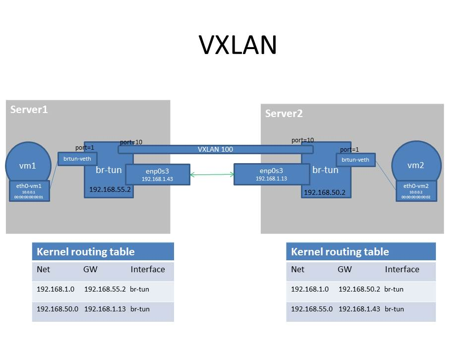

# OVS Tunneling
## VirtualBox 
Launch 2 `Xenial` VM with a `internal network` through `VirtualBox`



## Server1
### Namespace `vm1`
- create namespace `vm1`: `ip netns add vm1`

### Network Interfaces
- setup `enp0s3`
```bash
printf "auto enp0s3\n \
iface enp0s3 inet static\n \
netmask 255.255.255.0\n \
address 192.168.1.43\n \
gateway 192.168.1.13\n" >> /etc/network/interfaces
```
- activate `enp0s3`: `ifconfig enp0s3 down` and `ifconfig enp0s3 up` (maybe we need to restart the VM)
- create OVS bridge `br-tun`: `ovs-vsctl add-br br-tun`
- create a pair `veth`: `ip link add eth0-vm1 type veth peer name brtun-veth`
- put `eth0-vm1` in `VM1`: `ip link set eth0-vm1 netns vm1`
- bind `br-tun` ports: `ovs-vsctl add-port br-tun brtun-veth`
- bind `br-tun` ports: `ovs-vsctl add-port br-tun enp0s3`
- activate `brtun-veth`: `ip link set brtun-veth up`
- add IP address to `br-tun`: `ifconfig br-tun down` and `ifconfig br-tun 192.168.55.2 netmask 255.255.255.0 up`

### Route Table
- clean route table `route del -net 192.168.1.0 netmask 255.255.255.0 gw 0.0.0.0 dev enp0s3`
- create a route for `VBox Internal Network`: `route add -net 192.168.1.0/24 gw 192.168.55.2 dev br-tun`
- create a route to bind to `OVS bridges`: `route add -net 192.168.50.0/24 gw 192.168.1.13 dev br-tun`

### Namespace Configuration
- `ip netns exec vm1 ip link set dev lo up`
- `ip netns exec vm1 ip link set eth0-vm1 up`
- `ip netns exec vm1 ip address add 10.0.0.1/24 dev eth0-vm1`
- `ip netns exec vm1 ip link set dev eth0-vm1 address 00:00:00:00:00:01`
- `ip netns exec vm1 ip route add default dev eth0-vm1`

### FlowTable Configuration
- clear the flowtable: `ovs-ofctl del-flows br-tun table=0`
- create a `VXLAN` with `VXLAN_ID=100` and `in-port=10` between 2 `OVS bridges`: `ovs-vsctl add-port br-tun vtep -- set interface vtep type=vxlan option:local_ip=192.168.55.2 option:remote_ip=192.168.50.2 option:key=flow ofport_request=10`
- set `VXLAN_ID=100` for all flows from `VM1` (`in-port=1`): `ovs-ofctl add-flow br-tun "table=0,in_port=1,actions=set_field:100->tun_id,resubmit(,1)"`
- `ovs-ofctl add-flow br-tun "table=0,actions=resubmit(,1)"`

Setup communication between `vm1` and `vm2`
- `ovs-ofctl add-flow br-tun "table=1,priority=150,tun_id=100,dl_dst=00:00:00:00:00:01,actions=output:1"`
- `ovs-ofctl add-flow br-tun "table=1,priority=150,tun_id=100,dl_dst=00:00:00:00:00:02,actions=output:10"`
- `ovs-ofctl add-flow br-tun "table=1,priority=150,tun_id=100,arp,nw_dst=10.0.0.1,actions=output:1"`
- `ovs-ofctl add-flow br-tun "table=1,priority=150,tun_id=100,arp,nw_dst=10.0.0.2,actions=output:10"`

Autorisation of traffic between `server1` and `server2`
- `ovs-ofctl add-flow br-tun "table=1,priority=50,actions=normal"`

## Server2
### Namespace `vm2`
- create namespace `vm2`: `ip netns add vm2`

### Network Interfaces
- setup `enp0s3`
```bash
printf "auto enp0s3\n \
iface enp0s3 inet static\n \
netmask 255.255.255.0\n \
address 192.168.1.13\n \
gateway 192.168.1.43\n" >> /etc/network/interfaces
```
- activate `enp0s3`: `ifconfig enp0s3 down` and `ifconfig enp0s3 up` (maybe we need to restart the VM)
- create OVS bridge `br-tun`: `ovs-vsctl add-br br-tun`
- create a pair `veth`: `ip link add eth0-vm2 type veth peer name brtun-veth`
- put `eth0-vm2` in `vm2`: `ip link set eth0-vm2 netns vm2`
- bind `br-tun` ports: `ovs-vsctl add-port br-tun brtun-veth`
- bind `br-tun` ports: `ovs-vsctl add-port br-tun enp0s3`
- activate `brtun-veth`: `ip link set brtun-veth up`
- add IP address to `br-tun`: `ifconfig br-tun down` and `ifconfig br-tun 192.168.50.2 netmask 255.255.255.0 up`

### Route Table
- clean route table `route del -net 192.168.1.0 netmask 255.255.255.0 gw 0.0.0.0 dev enp0s3`
- create a route for `VBox Internal Network`: `route add -net 192.168.1.0/24 gw 192.168.50.2 dev br-tun`
- create a route to bind to `OVS bridges`: `route add -net 192.168.55.0/24 gw 192.168.1.43 dev br-tun`

### Namespace Configuration
- `ip netns exec vm2 ip link set dev lo up`
- `ip netns exec vm2 ip link set eth0-vm2 up`
- `ip netns exec vm2 ip address add 10.0.0.2/24 dev eth0-vm2`
- `ip netns exec vm2 ip link set dev eth0-vm2 address 00:00:00:00:00:02`
- `ip netns exec vm2 ip route add default dev eth0-vm2`

### FlowTable Configuration
- clear the flowtable: `ovs-ofctl del-flows br-tun table=0`
- create `VXLAN` with `VXLAN_ID=100` and `in-port=10` between 2 `OVS bridges`: `ovs-vsctl add-port br-tun vtep -- set interface vtep type=vxlan option:local_ip=192.168.50.2 option:remote_ip=192.168.55.2 option:key=flow ofport_request=10`
- set `VXLAN_ID=100` for all flows from `VM1` (`in-port=1`): `ovs-ofctl add-flow br-tun "table=0,in_port=1,actions=set_field:100->tun_id,resubmit(,1)"`
- `ovs-ofctl add-flow br-tun "table=0,actions=resubmit(,1)"`

### Setup communication between `vm2` and `vm1`
- `ovs-ofctl add-flow br-tun "table=1,priority=150,tun_id=100,dl_dst=00:00:00:00:00:02,actions=output:1"`
- `ovs-ofctl add-flow br-tun "table=1,priority=150,tun_id=100,dl_dst=00:00:00:00:00:01,actions=output:10"`
- `ovs-ofctl add-flow br-tun "table=1,priority=150,tun_id=100,arp,nw_dst=10.0.0.2,actions=output:1"`
- `ovs-ofctl add-flow br-tun "table=1,priority=150,tun_id=100,arp,nw_dst=10.0.0.1,actions=output:10"`

Autorisation of traffic between `server2` and `server1`
- `ovs-ofctl add-flow br-tun "table=1,priority=50,actions=normal"`

## Test
In the server1:
- `ping 192.168.1.13`
- `ip netns exec vm1 ping 10.0.0.2`

## Cleanup 
before reboot
### server1
- `ovs-vsctl del-br br-tun` 
- `ip netns del vm1`

### server2
- `ovs-vsctl del-br br-tun` 
- `ip netns del vm2`

## Bug
### avahi-daemon 
We should stop the avahi-daemon
- `service --status-all`
- `systemctl disable avahi-daemon.socket`
- `systemctl disable avahi-daemon.service`
- `vim /lib/systemd/system/cups-browsed.service` and comment `#Wants=avahi-daemon.service`
- `systemctl stop avahi-daemon.socket` 
- `systemctl stop avahi-daemon.service` 
