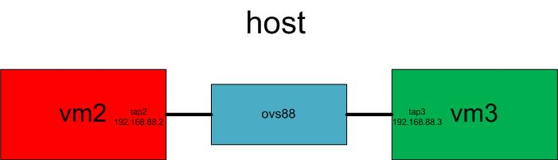

# OVS Bridge between VMs
## Topology


## Network Devices

- create an OVS bridge:
```bash
ovs-vsctl add-br ovs88
virsh net-create --file kvm-net.xml
```
- check: `ovs-vsctl show`

### VM2 Part
- create VM2: `virsh create kvm-vm2.xml`
- add an IP address: `ifconfig eth0 192.168.88.2/24 up`

### VM3 Part
- create VM3: `virsh create kvm-vm3.xml`
- add an IP address: `ifconfig eth0 192.168.88.3/24 up`

### Graphic Interface
- launch: `virt-manager`

## Test 
### In VM3
```bash
ping 192.168.88.2
```       

### In Host
- activate ovsbr0:
```bash
ifconfig ovsbr0 192.168.150.1/24 up
ovs-vsctl show
```
- no traffic through `eth0`: `tcpdump -i eth0 icmp`
- ICMP traffic through `vnet0`: `tcpdump -i vnet0 icmp`

## Debug
- please try to read the content of the 2 `.xml` files, adjustments may be needed for adapting your `vms`, here can be an exemple for `kvm-vm2.xml`:
```bash
        <disk type='file' device='disk'>
            <driver name='qemu' type='qcow2'/>
            <source file='debian_wheezy_amd64_standard2.qcow2'/>
            <target dev='hda' bus='ide'/>
            <address type='drive' controller='0' bus='0' target='0' unit='0'/>
        </disk>
```
