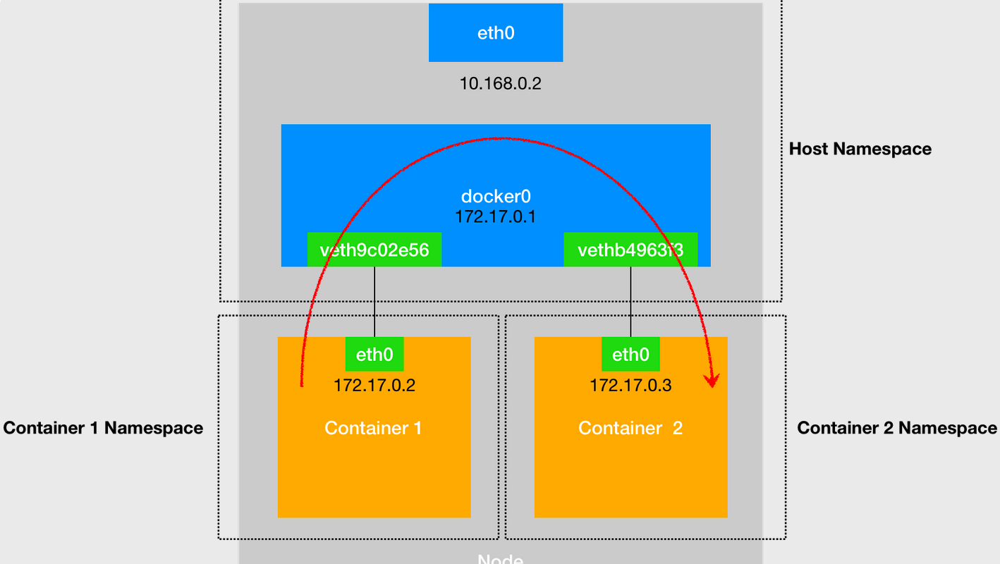
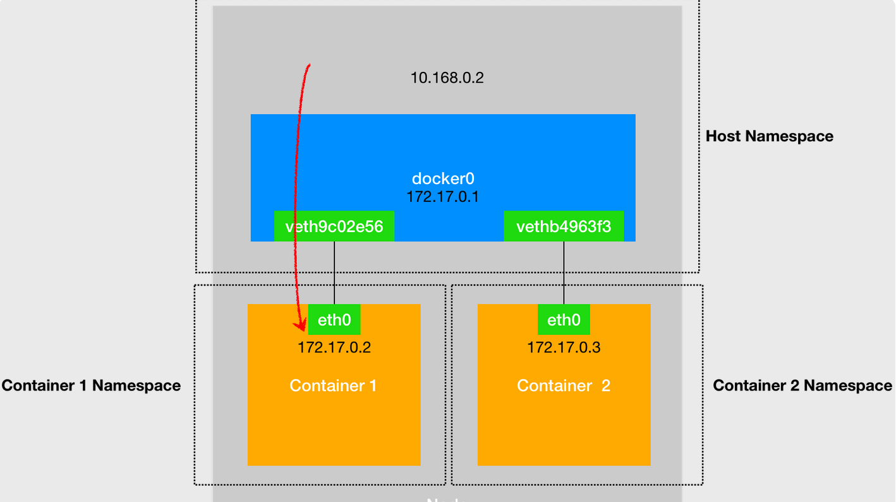
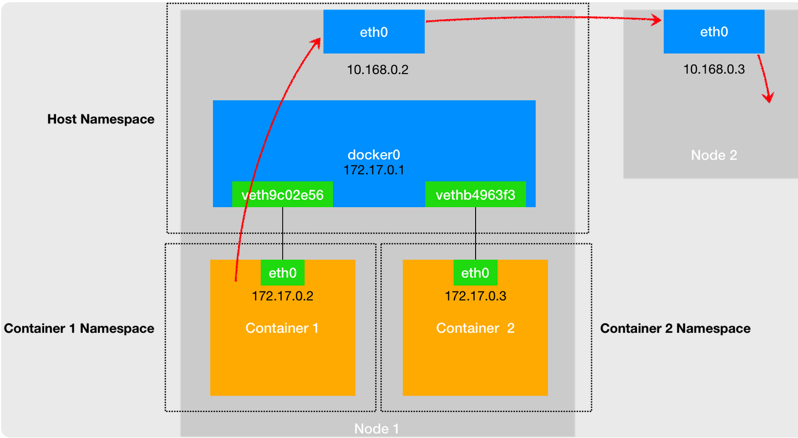

# 容器网络

## 容器-容器（同主机）

被限制在 Network Namespace 里的容器进程，实际上是通过 Veth Pair 设备 + 宿主机网桥的方式，实现了跟同其他容器的数据交换。

例如，在 src nginx-1（172.17.0.2）容器里访问 des nginx-2 容器的 IP 地址（172.17.0.3）：

- 路由：nginx-2的IP会匹配到 nginx-1容器里的第二条路由规则``172.17.0.0      0.0.0.0         255.255.0.0     U     0      0        0 eth0``，这条路由规则的网关（Gateway）是 0.0.0.0，这是一条直连规则，即：凡是匹配到这条规则的 IP 包，srcI和des在一个子网中，因此可以通过本机的eth0网卡直接发往des，不需要替换desMAC。
- ARP：通过ARP获得desMAC
  - 所以 nginx-1 容器的网络协议栈，就需要通过 eth0 网卡发送一个 ARP 广播，来通过 IP 地址查找对应的 MAC 地址。
  - nginx-1 容器的这个 eth0 网卡是一个 Veth Pair，它的一端在这个 nginx-1 容器的 Network Namespace 里，而另一端则位于宿主机上（Host Namespace），并且被“插”在了宿主机的 docker0 网桥上。
  - 网桥docker0在收到这些 ARP 请求之后，docker0 网桥就会扮演二层交换机的角色，把 ARP 广播转发到其他被“插”在 docker0 上的其他虚拟网卡上。
  - 连接在 docker0 上的 nginx-2 容器的网络协议栈就会收到这个 ARP 请求，从而将 172.17.0.3 所对应的 MAC 地址回复给 nginx-1 容器。
- 有了desMAC 地址，nginx-1 容器的 eth0 网卡就可以将数据包发出去。
- 根据 Veth Pair原理，这个数据包会立刻出现在宿主机上的 veth9c02e56 虚拟网卡上。
- veth9c02e56 网卡被插入docker0网桥，网络协议栈的资格已经被“剥夺”，所以这个数据包就直接流入到了 docker0 网桥里。docker0 处理转发的过程，则继续扮演二层交换机的角色。
- docker0 网桥根据数据包的desMAC 地址（也就是 nginx-2 容器的 MAC 地址），在它的 CAM 表（即交换机通过 MAC 地址学习维护的端口和 MAC 地址的对应表）里查到对应的端口（Port）为：vethb4963f3，然后把数据包发往这个端口。
- 这个端口正是 nginx-2 容器“插”在 docker0 网桥上的另一块虚拟网卡，当然，它也是一个 Veth Pair 设备。这样，数据包就进入到了 nginx-2 容器的 Network Namespace 里。
- nginx-2 容器看到的情况是，它自己的 eth0 网卡上出现了流入的数据包。这样，nginx-2 的网络协议栈就会对请求进行处理，最后将响应（Pong）返回到 nginx-1。

## 主机-容器

在一台宿主机上访问该宿主机上的容器的 IP  地址时：

- 这个请求的数据包先根据路由规则到达 docker0 网桥
- 然后被转发到对应的 Veth Pair  设备
- 最后出现在容器里。

## 容器 - 另一主机

同样地，当一个容器试图连接到另外一个宿主机时，如：ping  10.168.0.3，它发出的请求：

- 首先经过 docker0 网桥
- 出现在宿主机上
- 然后根据宿主机的路由表里的直连路由规则（10.168.0.0/24 via eth0)），对 10.168.0.3 的访问请求就会交给宿主机的 eth0 处理。
- 这个数据包就会经宿主机的 eth0 网卡转发到宿主机网络上，最终到达 10.168.0.3 对应的宿主机上。

## Ref

- 深入剖析Kubernetes（33讲）：https://time.geekbang.org/column/article/65287