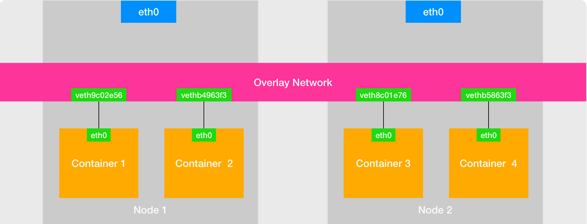
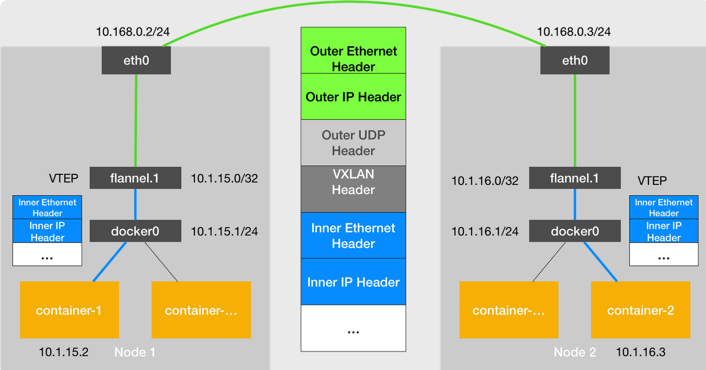
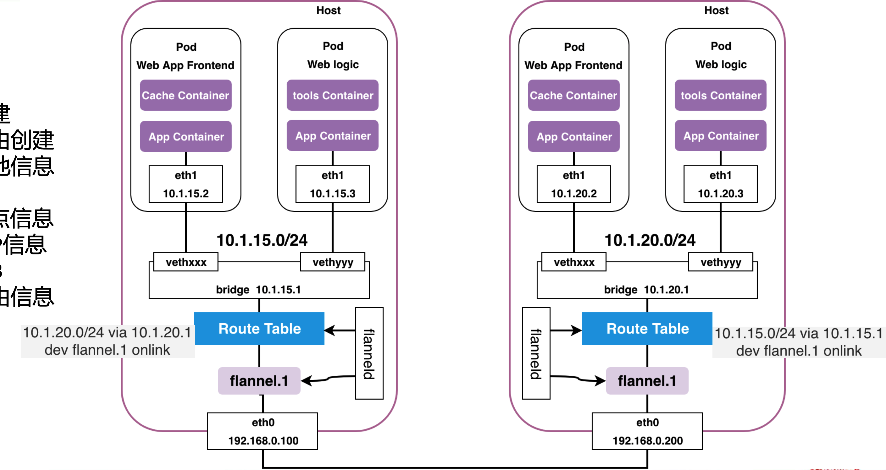
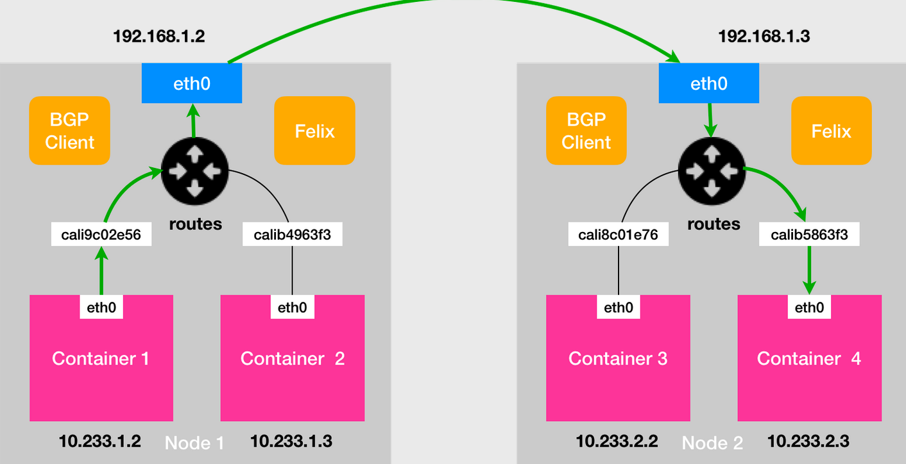
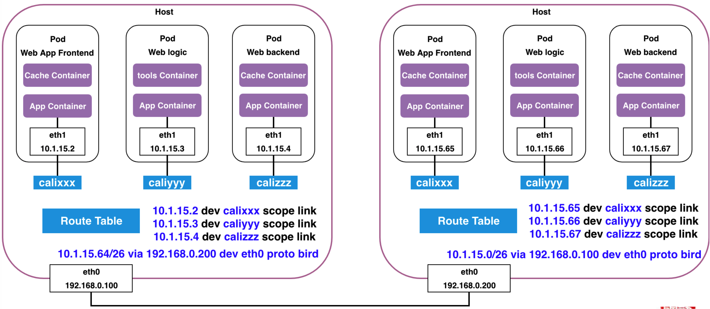
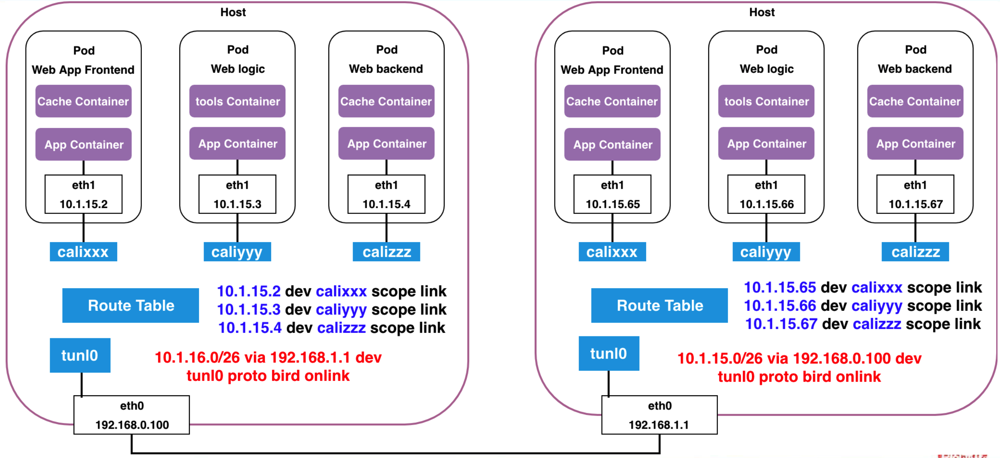

# k8s网络

## 简介：容器跨主机网络

在宿主机网络上，再通过软件构建一个覆盖在已有宿主机网络之上的、可以把所有容器连通在一起的虚拟网络Overlay Network。而这个Overlay Network本身，可以由每台宿主机上的一个“特殊网桥”共同组成。

比如，当 Node 1 上的 Container 1 要访问 Node 2 上的 Container 3 的时候，Node 1 上的“特殊网桥”在收到数据包之后，能够通过某种方式，把数据包发送到正确的宿主机，比如 Node 2 上。而 Node 2 上的“特殊网桥”在收到数据包后，也能够通过某种方式，把数据包转发给正确的容器，比如 Container 3。甚至，每台宿主机上都不需要有一个这种特殊的网桥，而仅仅通过某种方式配置宿主机的路由表，就能够把数据包转发到正确的宿主机上。

## Flannel架构

- SubNetManager：针对子网资源划分、IP资源申请 释放的接口定义
- Backend：针对网络互联方式的接口定义

## Flannel UDP

L2联通，通过tunnel使其在一个L2网络。

宿主机 Node 1 上有一个容器 container-1，它的 IP 地址是 100.96.1.2，对应的 docker0 网桥的地址是：100.96.1.1/24。宿主机 Node 2 上有一个容器 container-2，它的 IP 地址是 100.96.2.3，对应的 docker0 网桥的地址是：100.96.2.1/24。我们想让 container-1 访问 container-2。

- container-1 容器里的进程发起的 IP 包，srcIP 100.96.1.2，desIP 100.96.2.3。
- 这个 IP 在container-1 容器里包会被交给默认路由规则，通过veth进入 docker0 网桥，从而出现在node1上。
- 因为docker0网桥开启了bridge-nf-call-iptables模式，所以该包会由node1上的route table处理。
- Flannel 已经在node1创建出了一系列的路由规则。由于我们的 IP 包的目的地址是 100.96.2.3，它匹配不到本机 docker0 网桥对应的 100.96.1.0/24 网段，只能匹配到第二条、也就是 100.96.0.0/16 对应的这条路由规则，从而进入到一个叫作 flannel0 的设备中。
- flannel0 是一个 TUN 设备，当 IP 包进入 flannel0 设备后，宿主机上的 flanneld 进程就会收到这个 IP 包。
- flanneld 看到了这个 IP 包的desIP是 100.96.2.3，就把它通过UDP发送给了 Node 2。每台宿主机上的 flanneld都监听着 8285 端口，所以 flanneld 只要把 UDP 包发往 Node 2 的 8285 端口即可。
- Node 2 上的flanneld监听 8285 端口，flanneld 就可以从这个 UDP 包里解析出封装在里面的、container-1 发来的原 IP 包。
- flanneld 会直接把这个 IP 包发送给它所管理的 TUN 设备，即 flannel0 设备，从而从用户态向内核态的流动方向，所以 Linux 内核网络栈就会负责处理这个 IP 包。
- node2的网络栈通过本机的route table来寻找这个 IP 包的下一步流向。
- Linux 内核就会按照这条路由规则，把这个 IP 包转发给 docker0 网桥。
- docker0 网桥会扮演二层交换机的角色，将数据包发送给正确的端口，进而通过 Veth Pair 设备进入到 container-2 的 Network Namespace 里。

在由Flannel管理的容器网络里，一台宿主机上的所有容器都属于该宿主机被分配的一个“子网”。在我们的例子中，Node 1 的子网是 100.96.1.0/24，container-1 的 IP 地址是 100.96.1.2。Node 2 的子网是 100.96.2.0/24，container-2 的 IP 地址是 100.96.2.3。而这些子网与宿主机的对应关系，正是保存在 Flannel的Etcd 当中。Flannel通过对应关系找到desIP所在的子网（宿主机）。

Flannel UDP  模式提供的其实是一个三层的 Overlay 网络，即：它首先对发出端的 IP 包进行 UDP 封装，然后在接收端进行解封装拿到原始的 IP  包，进而把这个 IP 包转发给目标容器。这就好比，Flannel 在不同宿主机上的两个容器之间打通了一条“隧道”，使得这两个容器可以直接使用  IP 地址进行通信，而无需关心容器和宿主机的分布情况。

## Flannel VxLAN

L2联通，通过tunnel使其在一个L2网络。

下图中每台宿主机上名叫 flannel.1（Linux bridge）的设备，就是 VXLAN 所需的 VTEP 设备，它既有 IP 地址，也有 MAC 地址。

container-1 的 IP 地址是 10.1.15.2，要访问的 container-2 的 IP 地址是 10.1.16.3。

- 当 container-1 发出请求之后，这个目的地址是 10.1.16.3 的 IP 包会出现在 docker0 网桥
- 然后被node1的route table路由到本机 flannel.1 设备，也就是到了“隧道”的入口。
- 为了能够将“原始 IP 包”封装并且发送到node2，VXLAN 就需要找到这条“隧道”的出口，即：目的宿主机的 VTEP 设备。而这个设备的信息，正是每台宿主机上的 flanneld 进程负责维护的。比如，当 Node 2 启动并加入 Flannel 网络之后，在 Node 1（以及所有其他节点）上，flanneld 就会添加一条路由规则：凡是发往 10.1.16.0/24 网段的 IP 包，都需要经过 flannel.1 设备发出，并被发往的网关地址是：10.1.16.0（Node 2 上的 VTE）。
- 这些 VTEP 设备之间要想办法组成一个虚拟的二层网络，即：通过二层数据帧进行通信。所以在我们的例子中，“源 VTEP 设备”收到“原始 IP 包”后，就要想办法把“原始 IP 包”加上一个目的 MAC 地址，封装成一个二层数据帧，然后发送给“目的 VTEP 设备”
- 目的 VTEP 设备的 MAC通过flanneld在 Node 2 节点启动时，自动 Node 1 上注入ARP记录。
- Linux 内核会把“目的 VTEP 设备”的 MAC 地址填写在frame，形成一个内部frame。
- Linux 内核还需要再把内部frame进一步封装成为宿主机网络里的一个普通的外部frame，好让它“载着”内部frame，通过宿主机的 eth0 网卡进行传输。Linux 内核会在内部frame前面加上一个特殊的 VxLAN 头。Linux 内核会把这个外部frame封装进一个 UDP 包里发出去。
- 在宿主机看来，它会以为自己的 flannel.1 设备只是在向另外一台宿主机的 flannel.1 设备发起了一次普通的 UDP 链接。flanneld维护着flannel.1（Linux bridge）中的FDB，即：发往目的 VTEP 设备的L2 frame应该通过 flannel.1 设备，发往 IP 地址为 10.168.0.3 的主机（node2的IP），从而为UDP提供desIP。
- Node 1 上的 flannel.1 设备就可以把这个frame从 Node 1 的 eth0 网卡发出去
- 这个frame会经过宿主机网络来到 Node 2 的 eth0 网卡。
- Node 2 的内核网络栈会发现这个数据帧里有 VXLAN Header，然后根据 VNI 的值把它交给 Node 2 上的 flannel.1 设备。
- 而 flannel.1 设备则会进一步拆包，取出“原始 IP 包”。
- 最终根据相同流程，IP 包就进入到了 container-2 容器的 Network Namespace 里。

VxLAN网络做以下项工作：

- 通过flanneld在每个节点维护各个VTEP的MAC和IP地址（分别注入ARP和Linux bridge  flannel.1的FDB中）
- 为每个frame注入VxLAN ID VIN，从而实现多VxLAN的隔离
- 在两个node上的flannel.1之间实现UDP tunnel，用于传递L2 frame，实现L2网络互连

该方案主要是通过Linux bridge之间可以建立VxLAN tunnel实现。

## Flannel host-gw

L3联通，通过路由联通。

Node 1 上的 Infra-container-1，要访问 Node 2 上的 Infra-container-2。

Flannel host-gw模式的flanneld 会在宿主机上创建这样一条路由规则，含义是：目的 IP 地址属于 10.244.1.0/24 网段的 IP 包，应该经过本机的 eth0 设备发出去（即：dev eth0），它下一跳地址（next-hop）是 10.168.0.3（即：via 10.168.0.3），正是、目的宿主机 Node 2。一旦配置了下一跳地址，、eth0 设备就会使用下一跳地址对应的 MAC 地址作为该frame的desMAC。

这样，这个frame就会从 Node 1 通过宿主机的二层网络顺利到达 Node 2 上。而 Node 2 的内核网络栈拿到 IP 包后，会“看到”这个 IP 包的目的 IP 地址是 10.244.1.3，即 Infra-container-2 的 IP 地址。根据 Node 2 上的路由表，该目的地址会匹配到第二条路由规则（也就是 10.244.1.0 对应的路由规则），从而进入 cni0 网桥，进而进入到 Infra-container-2 当中。

可以看到，host-gw模式的工作原理，其实就是将每个Flannel子网（Flannel Subnet，比如：10.244.1.0/24）的“下一跳”，设置成了该子网对应的宿主机的IP地址。也就是说，这台“主机”（Host）会充当这条容器通信路径里的“网关”（Gateway）。这也正是“host-gw”的含义。当然，Flannel子网和主机的信息，都是保存在Etcd当中的。flanneld只需要WACTH这些数据的变化，然后实时更新路由表即可。

## Calico

L3联通，通过路由联通。

Calico用BGP取代 Flannel，来维护主机上路由表的功能。BGP 这种原生就是为大规模网络环境而实现的协议，其可靠性和可扩展性，远非 Flannel 自己的方案可比。Calico 由三个部分组成：

- Calico 的 CNI 插件：这是 Calico 与 Kubernetes 对接的部分。

- Felix：一个 DaemonSet，负责在宿主机上插入路由规则（即：写入 Linux 内核的 FIB 转发信息库），以及维护 Calico 所需的网络设备等工作。

- BIRD：BGP 的客户端，专门负责在集群里分发路由规则信息。

除了对路由信息的维护方式之外，Calico 与 Flannel 的 host-gw 模式的另一个不同之处，就是它不会在宿主机上创建任何网桥设备。由于 Calico 没有使用 CNI 的网桥模式，Calico 的 CNI 插件还需要在宿主机上为每个容器的 Veth Pair 设备配置一条路由规则，用于接收传入的 IP 包。有了这样的 Veth Pair 设备之后，容器发出的 IP 包就会经过 Veth Pair 设备出现在宿主机上。然后，宿主机网络栈就会根据路由规则的下一跳 IP 地址，把它们转发给正确的网关。接下来的流程就跟 Flannel host-gw 模式完全一致了。其中，最核心的“下一跳”路由规则，就是由 Calico 的 Felix 进程负责维护的。这些路由规则信息，则是通过 BGP Client 也就是 BIRD 组件，使用 BGP 协议传输而来的。

Calico实际上将集群里的所有节点，都当作是边界路由器来处理，它们一起组成了一个全连通的网络，互相之间通过 BGP 协议交换路由规则。这些节点，我们称为 BGP Peer。需要注意的是，Calico 维护的网络在默认配置下，是一个被称为“Node-to-Node Mesh”的模式。这时候，每台宿主机上的 BGP Client 都需要跟其他所有节点的 BGP Client 进行通信以便交换路由信息。但是，随着节点数量 N 的增加，这些连接的数量就会以 N²的规模快速增长，从而给集群本身的网络带来巨大的压力。所以，Node-to-Node Mesh 模式一般推荐用在少于 100 个节点的集群里。

而在更大规模的集群中，你需要用到的是一个叫作 Route Reflector 的模式。在这种模式下，Calico 会指定一个或者几个专门的节点，来负责跟所有节点建立 BGP 连接从而学习到全局的路由规则。而其他节点，只需要跟这几个专门的节点交换路由信息，就可以获得整个集群的路由规则信息了。这些专门的节点，就是所谓的 Route Reflector 节点，它们实际上扮演了“中间代理”的角色，从而把 BGP 连接的规模控制在 N 的数量级上。

### 同网段/BGP支持

### IP隧道方案

## Ref

- 深入剖析Kubernetes（33讲）：https://time.geekbang.org/column/article/65287

