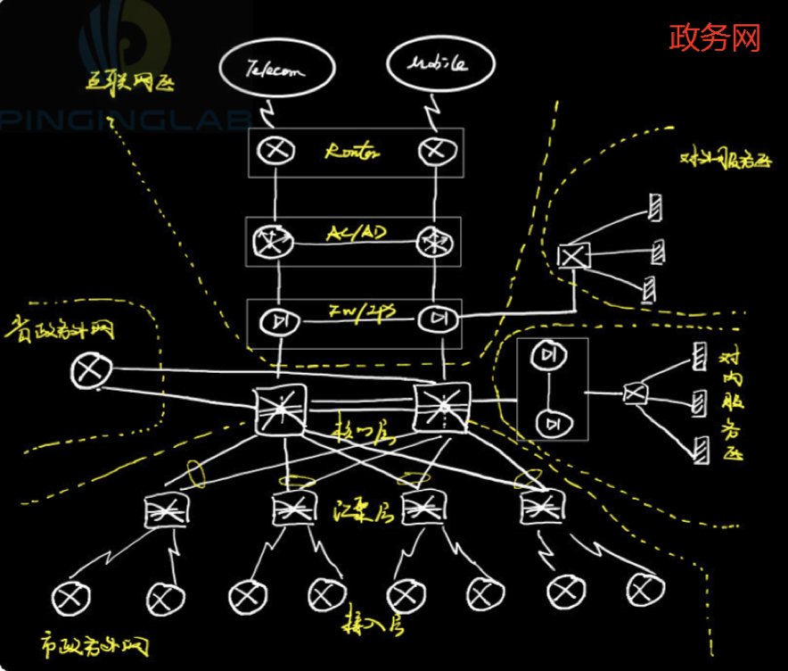
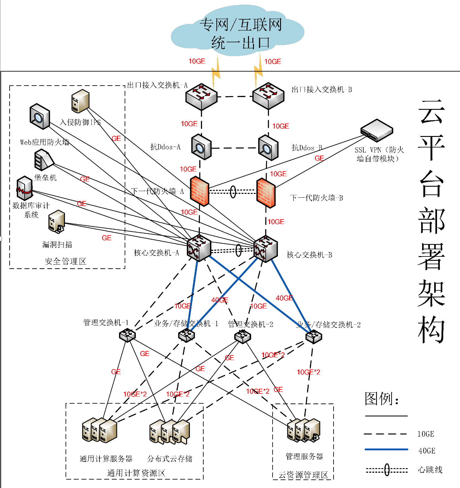
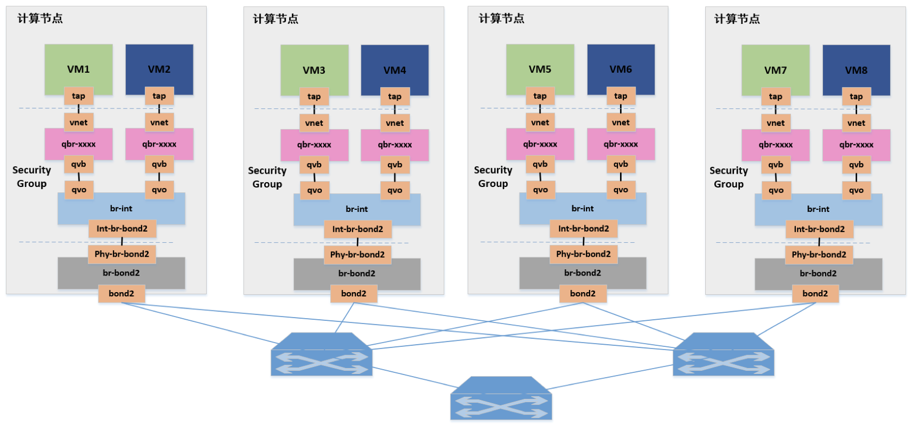
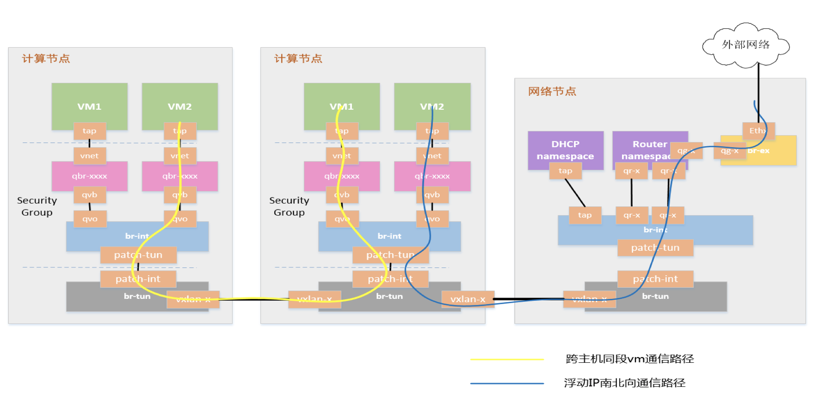
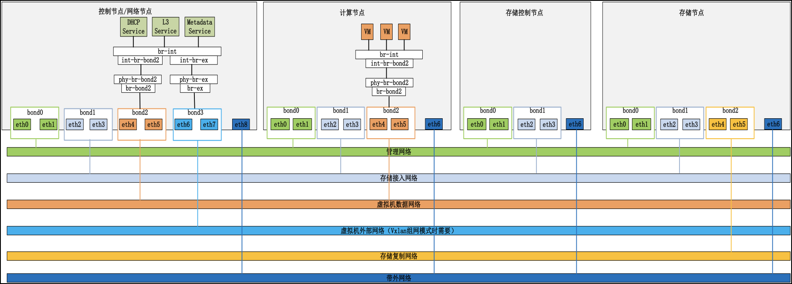

# IDC网络拓扑

## 总体拓扑

## OpenStack网络方案

### 总体介绍

VPC VxLAN的关系

- 一个VPC对于OpenStack的一个net，被分配一个vRouter，可以包含几个sub-net

### VLAN方案

在OpenStack的VLAN方案中，每个host上的OVS相当于一个支持VLAN的switch，以truck模式接到物理switch。因为只有使用truck模式，才能确保host起的VM可以属于不同的VLAN。

当不同VLAN之间的VM需要进行通信时，会通过核心交换机的L3路由实现。所以整个VLAN的方案转发都是在switch上，不需要用到OpenStack的Neutron网络控制节点。

### 缺点

- VLAN不支持浮动IP
- 跨VLAN的流量必须通过核心交换机（路由器）

### VxLAN方案

### 总体方案

- 同主机同VxLAN VM间通讯：通过主机内的OVS实现
- 跨主机同VxLAN VM间通讯：通过主机OVS间建立VxLAN隧道实现
- 同/跨主机不同VxLAN间通讯：会通过网络节点vRouter路由
- VM连接到外部网络：会通过网络节点连到外部网络

#### Overlay与Underlay融合

在云数据中心，部分业务是不适合进行虚拟化的（如小机服务器，高性能数据库服务器），这些服务器会直接与物理交换机互联，而他们又必须与对应租户/业务的VxLAN网络互通，此时就必须要求与其互联的硬件交换机也能支持VxLAN协议，以接入VxLAN网络。

考虑到服务器接入的可以是vSwitch，也可以是物理交换机，因此存在3种不同的构建模式：其中网络Overlay方案中，所有终端均采用在物理交换机上实现的VTEP；主机Overlay方案中，所有终端均采用vSwitch上实现的VTEP；混合Overlay方案中，既有物理交换机接入，又有vSwitch接入，且软件VTEP和硬件VTEP之间可以基于标准协议互通。
在网络Overlay方案和混合Overlay方案中，都需要有物理交换机设备支持VxLAN，并能与vSwitch构建的VTEP互通。由于在实际组网环境中，服务器种类很多，高吞吐高性能要求的业务一般都采用单独物理服务器甚至小机的硬件环境，而非虚拟化的x86服务器，这就没法使用vSwitch来接入VxLAN网络，只能让支持VxLAN的物理交换机来接入了。

## TStack网络架构

### 服务器网口

- 管理网：bond双网口，管理节点管控计算节点
- 存储网：bond双网口，云平台对接存储集群
- 业务网：bond双网口，VM之间的业务
- 存储内网：bond双网口，存储复制网，Ceph内部网络
- 带外网：单网口，裸金属纳管
- VM外网：bond双网口，一般与管理网共用，VxLAN模式下VM链接外部网络

